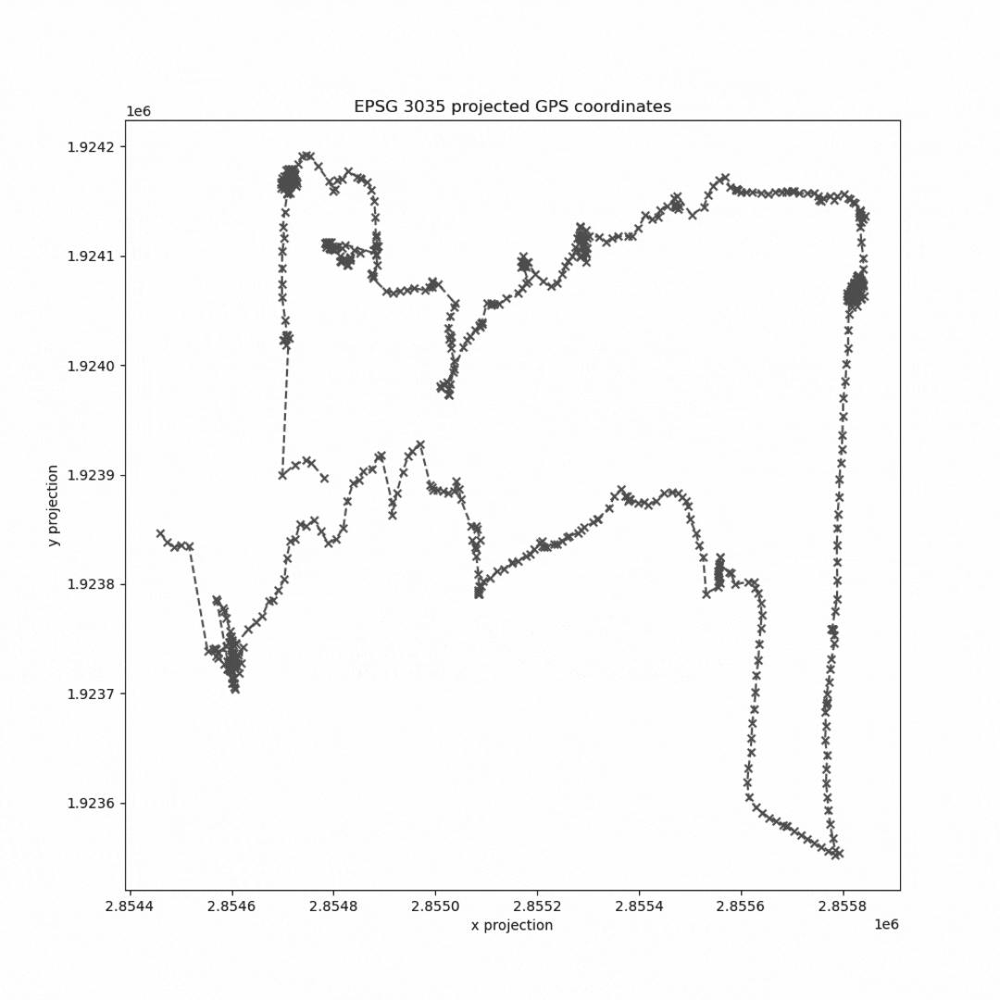

<br/>
<p align="center">
  <h3 align="center">Stop & Go Classifier</h3>

  <p align="center">
    Accurately identify significant places (stops) in GPS trajectories!
    <br/>
    <br/>
    <a href="https://github.com/RGreinacher/Stop-Go-Classifier/issues">Report Bug</a>
    .
    <a href="https://github.com/RGreinacher/Stop-Go-Classifier/issues">Request Feature</a>
  </p>
</p>

    

## Table Of Contents

* [About the project](#about-the-project)
* [Installation](#installation)
* [Usage](#usage)
* [Cite this project](#cite-this-project)
* [Roadmap](#roadmap)
* [Contributing](#contributing)
* [License](#license)
* [Author & License](#author-license)
* [Acknowledgments](#acknowledgments)

## About the project

The Stop & Go Classifier takes a list of raw GPS samples and identifies significant locations (stops). In other words: It transforms a list of position records into intervals of dwelling and transit.



This is often the first processing step when data-sciencing mobility data. Instead of dealing with raw timestamps and coordinates, you mostly want to see where people went and how long they stayed (significant locations). This is just the right tool for the job.

Key concepts

* Geometric analysis of a GPS trajectory's shape by using the signal's noise and incorporating its properties into the classification decision
* Multiple (four) independent analyses to form a majority-based decision on how to classify each GPS sample
* Free Python3 software

We provide a complete (open access) paper describing all concepts if you're interested in the nitty-gritty details of how this works. Additionally, it provides a benchmark against well-known libraries to put its performance into perspective.

## 💾 Installation

At this early stage, the classifier is unavailable via the standard package managers (this will come later!). For now, please clone this repository and import the `StopAndGoClassifier.py` file.

```python
sys.path.append('path/to/cloned/repo')
from StopAndGoClassifier import StopAndGoClassifier
```

### Dependencies

- `scipy`
- `numpy`
- `pandas`
- (`geopandas` if you need to project raw GPS coordinates first)

## ⌨️ Usage

Use the Stop & Go Classifier from StopAndGoClassifier.py the following way. Create an instance, read your data (timestamps and x&y coordinates), and run the pipeline. Note that the classifier works only on a planar projection of your coordinates, not the plain GPS longitude/latitude. The example folder provides a demo script to convert one into the other.

```
# create instance
classifier = StopAndGoClassifier()

# read input
classifier.read(data.ts, data.x, data.y)

# start pipeline
identified_stops_df = classifier.run()
```

The `run()` method capsules the following calls:

- `process_samples()` - classifies each sample as trip or stop
- `aggregate()` - groups subsequent trips and stops together and forms a table of stops with a start and end time property
- `filter_outliers()` - decides to either remove, merge, or keep each identified stop
- `isolate_trip_samples()` - similar to the stop intervals, this creates a list of the trip intervals.

The system can be tuned using the following settings:

- `MIN_STOP_INTERVAL` - time in seconds; stops below this threshold will be ignored
- `RELEVANT_STOP_DURATION` - time in seconds; stops longer than this will always be kept
- `MIN_DISTANCE_BETWEEN_STOP` - distance in meters; min distance two consecutive stop places must have
- `RELEVANT_DISTANCE_BETWEEN_STOP` - distance in meters; stop with such a distance will always be kept
- `MIN_TIME_BETWEEN_STOPS` - time in seconds; remove or merge if less than this threshold
- `RELEVANT_TIME_BETWEEN_STOPS` - time in seconds; a trip between two stops is relevant if it is longer than this threshold
- `MAX_TIME_BETWEEN_STOPS_FOR_MERGE` - time in seconds; should not merge stops having more than this time between each other

However, several other parameters, e.g., to disable certain classification methods., are available. These should be described in detail in a wiki. Call the classifier to apply a new setting using the optional argument `overwrite_settings`.

```
settings = {
	'USE_METHOD_ISA': False,
	'MIN_STOP_INTERVAL': 79,
}
classifier = StopAndGoClassifier(overwrite_settings=settings)
```

This repo comes with a few examples and some demo data. Check out the *examples* folder and run the scripts.

## 🎓 Cite this project

This algorithm was introduced at the FOSS4G 2022 conference in Florence, Italy. There, we presented a paper describing the algorithm's architecture and a performance comparison against SciKit Mobility and Moving Pandas's significant locations detection. If you're interested in how the *Stop & Go Classifier* works, read this paper:

Spang, R. P., Pieper, K., Oesterle, B., Brauer, M., Haeger, C., Mümken, S., Gellert, P., Voigt-Antons, J.-N., 2022. Making Sense of the Noise: Integrating Multiple Analyses for Stop and Trip Classification. Proceedings of FOSS4G, Florence, Italy.

```
@article{spang2022stopgofoss4g,
  title={Making Sense of the Noise: Integrating Multiple Analyses for Stop and Trip Classification},
  author={Spang, Robert P. and Pieper, Kerstin and Oesterle, Benjamin and Brauer, Max and Haeger, Christine and Mümken, Sandra and Gellert, Paul and Voigt-Antons, Jan-Niklas},
  journal={Proceedings of FOSS4G, Florence, Italy},
  year={2022}
}
```

(This publication will be available from August 24th, 2022 onwards.)

## 🗺️ Roadmap

See the [open issues](https://github.com/RGreinacher/Stop-Go-Classifier/issues) for a list of proposed features (and known issues).

## 🤝 Contributing

Contributions make the open-source community a fantastic place to learn, inspire, and create. Any contributions you make are **greatly appreciated**.
* If you have suggestions for adding or removing projects, feel free to [open an issue](https://github.com/RGreinacher/Stop-Go-Classifier/issues/new) to discuss it or directly create a pull request after you edit the *README.md* file with necessary changes.
* Please make sure you check your spelling and grammar.
* Create individual PR for each suggestion.
* Please also read through the [Code Of Conduct](https://github.com/RGreinacher/Stop-Go-Classifier/blob/main/CODE_OF_CONDUCT.md) before posting your first idea as well.

### Creating A Pull Request

1. Fork the project
2. Create your feature branch (`git checkout -b feature/AmazingFeature`)
3. Commit your changes (`git commit -m 'Add some AmazingFeature'`)
4. Push to the branch (`git push origin feature/AmazingFeature`)
5. Open a pull request

## 🙋🏻 Author & 📝 License

👤 Robert Spang, QULab, TU Berlin
🐦 @RGreinacher
✉️ spang➰tu-berlin.de

Copyright © 2022 Robert Spang
This project is [BSD 3-Clause](https://github.com/RGreinacher/Stop-Go-Classifier/blob/main/LICENSE.md) licensed.

## 🙏🏻 Acknowledgments

Thanks for the [README generator](https://readme.shaankhan.dev), [Shaan Khan](https://github.com/ShaanCoding/)!
